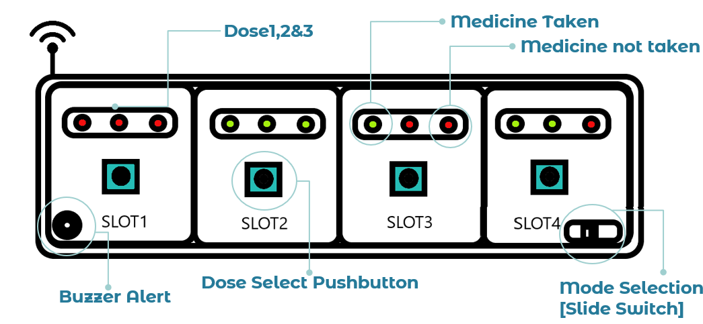

# Shoron: Smart Medicine Box with Alerts and Notifications

**Description:**  
Shoron is a smart medicine box designed to assist users with medication management. The system features colorful LED indicators for each dose and medicine, along with timing alerts. If a dose is missed, the system sends an SMS notification to an emergency contact stored in an SD card module.

---

**Features:**  
- **Colorful LED Indicators**: Each dose and medicine is represented by an RGB LED for visual identification.  
- **Timing Alerts**: Alerts are triggered at preset times to remind the user of their medication.  
- **Missed Dose Notifications**: If a dose is missed, an SMS is sent to an emergency contact.  
- **Emergency Contact Storage**: Contact information is saved and managed through the SD card module.  
- **Low Power Management**: The system includes features to optimize power usage for prolonged operation.  

---

**Components:**  
1. **ATmega 2560 AVR MCU**: Microcontroller to handle system operations.  
2. **SIM 800L GSM Module**: Sends SMS notifications to emergency contacts.  
3. **RGB LED Indicator**: Provides visual identification for each dose and medicine.  
4. **LED**: General indicators for system status.  
5. **Selection Button**: For user input and configuration.  
6. **Buzzer**: Audible alerts for medication reminders.  
7. **Low Power Management System**: Ensures efficient energy usage.

---

**System Workflow:**  
1. **Medication Setup**:  
   - Configure the medication schedule and dosage using the system interface.  
   - Assign each medication a unique color through the RGB LED indicator.  

2. **Alerts and Notifications**:  
   - The system alerts the user at the scheduled time using LEDs, buzzers, and notifications.  
   - If the user misses a dose, the system automatically sends an SMS to the emergency contact.  

3. **Emergency Contact Management**:  
   - Store and manage emergency contact information in the SD card module.  

4. **Power Optimization**:  
   - The low power management system ensures efficient operation during periods of inactivity.  

---

**Device Image:**  

---

**Applications:**  
- Medication management for elderly or chronically ill patients.  
- Assistance for users with memory challenges to ensure timely medication intake.  
- Real-time updates for caregivers in case of missed doses.  

---
